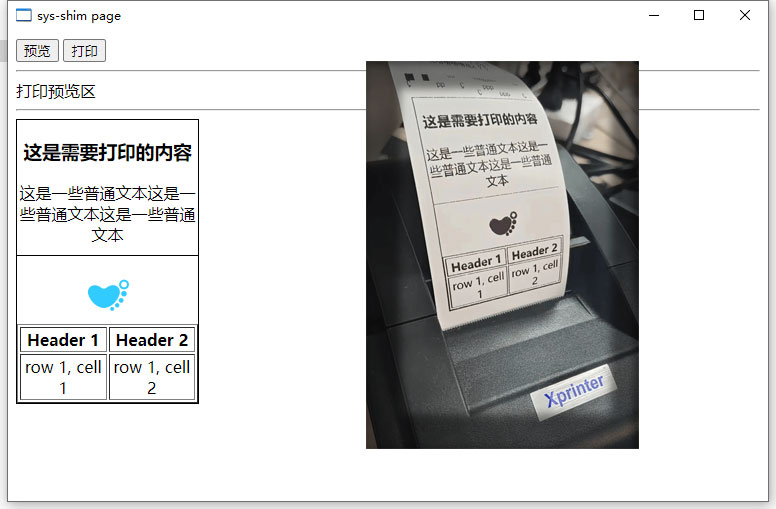

填写任意页面之后，向页面注入一个打印方法，直接调用即可打印任意 html 节点。

<div align="center">
  
</div>

## 使用

首先保证你的打印机已连接并正常可用。例如在百度上添加一个打印功能：

第一步：

把 https://baidu.com 填入 package.json 文件的 page 处，运行 main.exe。

第二步：

在页面中调用 tool.print() 方法，传入要打印的 html 即可。

例如：

```js
window.tool.print(document.querySelector(`span`));
```

## 环境

当前测试过的环境如下：

- os: win11 / win10 / win7 x64
- node: 13.14+

打印机：

- 厂家: Xprinter 芯烨
- 型号: XP-58IIH 热敏小票打印机
- 接口: USB
- 纸宽: 58mm

## 开发

浏览器的代码在 preload.js 中。服务器的代码在 sys.js 中，由 nodejs 运行，主要使用了 node-escpos 实现打印功能。

exe 使用方式可参考 [sys-shim](https://github.com/wll8/sys-shim)。